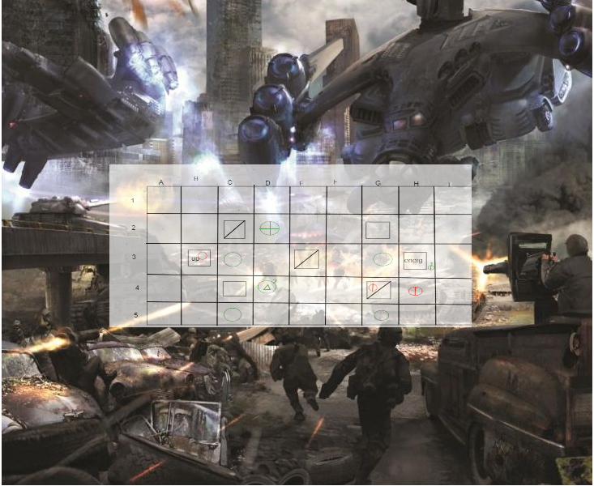

# Dropgrid Commander -> (Proffesional Collabrative Project)

**(Font is Banschift SemiLight)**

This is a long-term project to between [Kevin][Kevinhref] and [myself][Mehref]to develop a turn-based multipalyer computer game.

## Notes/Know Bugs:

> Game is currently in an unplayable state

## Features(Planned In Brackets)

> (Custom pixel art for units, terrain and events)

> (Multiplayer functionality)

> (Cheat-checking)

> (A.I bots)

## View of progress

No Image yet

## Latest Build
Still In progress

## Latest Update

06/10/2020 - DropgridCommander 2.0 

*Using new Monogame 3.8 Framework
*Modular Pixel Art
*Better Documentation

## Next Build

Week ending 30/11/2020 -Release 0.1a - Version 2 using monogame 3.8

* Add Randomly Generated Grid

* Add clicking unity on grid, allowing them to move to adjacent grids

## Skill developing

I plan on this project improving my skills in the following:

> C#

> Source control and git

>Pixel Art and Animation

## Installing and Compiling:
Project not yet installable 
